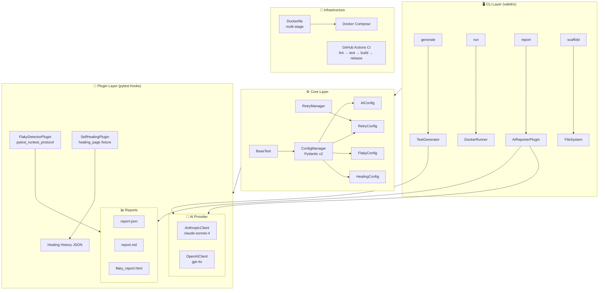

<br>

<div align="center">

# ⚡ Validrix

### AI-Powered PyTest Plugin Framework

[](https://github.com/mehedi-kme08/validrix/actions/workflows/ci.yml)
[](https://www.python.org/downloads/)
[](https://opensource.org/licenses/MIT)
[](https://github.com/astral-sh/ruff)
[](https://mypy-lang.org/)
[](https://hub.docker.com/)

**Write tests in English. Ship with confidence.**

[Quick Start](#-quick-start) · [Features](#-features) · [Architecture](#-architecture) · [CLI](#-cli-reference) · [Design Decisions](#-design-decisions) · [Roadmap](#-roadmap)

</div>

---

## The Problem

Modern test automation has three unresolved pain points:

| Pain | Reality |
|------|---------|
| **Writing tests is slow** | Senior engineers spend 40 % of their time writing boilerplate test code that adds no unique insight |
| **Flaky tests erode trust** | A single intermittently failing test causes teams to ignore CI — the canary stops working |
| **Locator maintenance is a tax** | Every UI redesign breaks dozens of selectors; engineers become CSS archaeologists instead of testers |

Validrix attacks all three problems in a single, composable framework.

---

## ✨ Features

### 🤖 AI Test Generator
Convert a plain-English description into a complete, runnable test file in seconds.

```bash
validrix generate "Login page with email, password, and Remember Me checkbox"
```

```python
# AUTO-GENERATED by Validrix AI Generator
# Feature: Login page with email, password, and Remember Me checkbox
import pytest
from playwright.sync_api import Page

class TestLoginPage:
    """Tests for the login page with email, password, and Remember Me checkbox."""

    @pytest.mark.smoke
    def test_valid_login_redirects_to_dashboard(self, page: Page) -> None:
        """Verify that valid credentials redirect the user to the dashboard."""
        # Arrange
        page.goto("/login")
        # Act
        page.locator("#email").fill("user@example.com")
        page.locator("#password").fill("SecurePass123!")
        page.locator("button[type='submit']").click()
        # Assert
        assert page.url.endswith("/dashboard"), "Expected redirect to /dashboard"

    @pytest.mark.parametrize("email,password", [
        ("", "SecurePass123!"),
        ("not-an-email", "SecurePass123!"),
        ("user@example.com", ""),
    ])
    def test_invalid_credentials_show_error(
        self, page: Page, email: str, password: str
    ) -> None:
        """Verify that invalid inputs surface an error message."""
        ...
```

---

### 🩹 Self-Healing Locators
When a Playwright selector fails, Validrix automatically tries fallback strategies and logs every healing event.

```python
def test_checkout(healing_page):
    # If "#submit-btn" is renamed to "#place-order" in the next sprint,
    # Validrix heals the locator automatically using aria-label or text content.
    healing_page.locator("#submit-btn").click()
```

Fallback chain: `aria-label` → `text content` → `nearby ancestor` → `CSS rebuild`

---

### 🔬 Flaky Test Detector
Run every test N times, compute a pass rate, and get a beautiful HTML report.

```bash
pytest --detect-flaky --flaky-runs=5
```

```
FLAKY  tests/e2e/test_payment.py::test_stripe_webhook  (60% pass, score: 0.80)
STABLE tests/unit/test_auth.py::test_token_expiry      (100% pass)
```

---

### 📊 AI Failure Summariser
After a failing CI run, get an actionable root-cause analysis — not just a raw traceback.

```markdown
## Executive Summary
3 tests failed due to a broken authentication header introduced in PR #847.
All failures share the same `401 Unauthorized` response from `/api/v2/users`.

### test_get_user_profile
- **Root Cause**: Missing `Authorization: Bearer` prefix — token sent as raw string
- **Likely Fix**: Update `auth_header` fixture in `conftest.py` line 42
- **Severity**: Critical
```

---

## 🚀 Quick Start

### Prerequisites
- Python 3.11+
- Docker (optional, for containerised runs)

### Install

```bash
pip install validrix
```

Or from source:

```bash
git clone https://github.com/mehedi-kme08/validrix.git
cd validrix
pip install -e ".[dev]"
playwright install chromium
```

### Configure

Create `validrix.yml` in your project root:

```yaml
environment: dev

ai:
  provider: anthropic
  model: claude-sonnet-4-20250514

environments:
  dev:
    base_url: http://localhost:3000
    headless: true
  staging:
    base_url: https://staging.example.com
    headless: true
```

Set your API key:

```bash
export VALIDRIX_AI_ANTHROPIC_API_KEY="sk-ant-..."
```

### Generate Your First Test

```bash
validrix generate "User registration with name, email, and password validation"
```

### Run Tests

```bash
# Local
pytest tests/

# With flaky detection
pytest --detect-flaky --flaky-runs=3

# In Docker
validrix run --docker --env staging

# Generate AI failure report after a run
validrix report
```

---

## 🏗 Architecture



### Layer Responsibilities

| Layer | Responsibility | Key Principle |
|-------|---------------|---------------|
| **Core** | Config, base classes, retry | No business logic; only primitives |
| **Plugins** | pytest hook implementations | Zero cross-plugin imports |
| **CLI** | Developer UX | Thin shell over Core + Plugins |
| **Integrations** | Docker, CI adapters | Infrastructure concern isolation |

---

## 🖥 CLI Reference

```
validrix generate "<description>"          Generate AI test cases
  --output / -o <path>                   Save to file
  --provider [anthropic|openai]          Override AI provider
  --context / -c "<extra instructions>"  Additional prompt context
  --dry-run                              Print without saving

validrix run                               Run test suite
  --env [dev|staging|prod]              Target environment
  --docker                               Run inside Docker
  --detect-flaky                         Enable flaky detection
  --marker / -m "<expression>"           pytest -m filter

validrix report                            Generate AI failure summary
  --output-dir / -d <path>              Report directory

validrix scaffold <project_name>           Scaffold new test project
  --destination / -d <path>             Parent directory
```

---

## ⚙ Configuration Reference

```yaml
# validrix.yml — full schema

environment: dev              # Active environment

ai:
  provider: anthropic         # anthropic | openai
  model: claude-sonnet-4-20250514
  max_tokens: 4096
  temperature: 0.2
  timeout_seconds: 60

retry:
  max_attempts: 3
  delay_seconds: 1.0
  backoff_multiplier: 2.0
  jitter: true

flaky:
  enabled: true
  runs: 3                     # Times to run each test
  threshold: 0.5              # Pass rate below this → FLAKY
  report_path: validrix_reports/flaky_report.json

healing:
  enabled: true
  history_path: validrix_reports/healing_history.json
  fallback_order:
    - aria-label
    - text
    - nearby
    - css

environments:
  dev:
    base_url: http://localhost:3000
    headless: true
    timeout_ms: 30000
  staging:
    base_url: https://staging.example.com
    headless: true
  prod:
    base_url: https://example.com
    headless: true
```

Environment variables override YAML (prefix: `VALIDRIX_`, nested delimiter `__`):
```bash
VALIDRIX_ENVIRONMENT=staging
VALIDRIX_AI__ANTHROPIC_API_KEY=sk-ant-...   # nested: AI__ANTHROPIC_API_KEY
VALIDRIX_AI__MODEL=claude-opus-4-7          # nested: AI__MODEL
VALIDRIX_RETRY__MAX_ATTEMPTS=5              # nested: RETRY__MAX_ATTEMPTS
```

---

## 🧠 Design Decisions

### 1. Plugin Architecture via pytest Entry Points
**Decision**: Register plugins through `pyproject.toml` `[project.entry-points."pytest11"]` rather than importing them in user conftest files.

**Why**: This is how pytest's own first-party plugins (pytest-cov, pytest-asyncio) work. Users get plugins automatically on `pip install validrix` — zero boilerplate. Third parties can ship compatible plugins as standalone PyPI packages.

**Alternative rejected**: A central plugin registry class would require users to call `validrix.register_plugins()` in their conftest — friction that breaks "it just works" expectations.

---

### 2. Prompt Engineering over Fine-Tuning for AI Features
**Decision**: Use a versioned system prompt with the foundation model API rather than fine-tuning.

**Why**: Fine-tuning requires labelled training data (we have none), retraining every time pytest's API changes, and ongoing infrastructure. A well-crafted prompt leverages the foundation model's existing Python knowledge and produces higher-quality output for our use case.

**Tradeoff accepted**: We are dependent on the provider's model quality and API availability. Mitigated by the `_LLMClient` ABC that lets us swap providers in one line.

---

### 3. Post-Session AI Reporting (Batch vs. Per-Failure)
**Decision**: Collect all failures during the session, then send a single batch request at `pytest_sessionfinish`.

**Why**: Cross-failure pattern analysis (seeing that 8 of 10 failures share the same `401` error) produces dramatically better root-cause summaries than per-failure analysis. One API call vs. N calls also reduces cost and latency.

**Tradeoff accepted**: If the session is killed mid-run, we miss the report. Mitigation: we write a JSON checkpoint after each failure, so `validrix report` can resume.

---

### 4. Self-Healing via Proxy, not Subclass
**Decision**: Wrap Playwright's `Page` in a `HealingPage` proxy rather than subclassing.

**Why**: Playwright's `Page` class is auto-generated from the CDP protocol spec and is effectively sealed — subclassing is fragile across releases. The proxy delegates all calls transparently via `__getattr__` and only intercepts `locator()`.

**Tradeoff accepted**: Dynamic dispatch via `__getattr__` loses IDE autocompletion for `HealingPage`. Engineers who need autocomplete can type-annotate their fixtures as `Page` while the runtime object is `HealingPage`.

---

### 5. Pydantic v2 for Configuration
**Decision**: Use Pydantic v2 `BaseSettings` for the config model instead of a plain dict.

**Why**: Type validation at load time catches config errors before any test runs. Automatic environment variable overlay eliminates custom parsing code. IDE autocomplete for config keys eliminates a whole class of typo bugs.

**Tradeoff accepted**: Pydantic v2 is a compiled Rust extension (~6 MB). Acceptable for a framework that runs in CI; would reconsider for an embedded library.

---

## 🗺 Roadmap

| Priority | Feature | Status |
|----------|---------|--------|
| P0 | AI test generation (Claude) | ✅ Done |
| P0 | Self-healing Playwright locators | ✅ Done |
| P0 | Flaky test detector | ✅ Done |
| P0 | AI failure summariser | ✅ Done |
| P1 | VS Code extension — generate tests from editor | 🔄 Planned |
| P1 | GitHub Action — AI PR review for test quality | 🔄 Planned |
| P1 | Visual regression plugin (screenshot diff + AI description) | 🔄 Planned |
| P2 | Time-series flakiness dashboard (Prometheus metrics) | 🔄 Planned |
| P2 | AI-powered locator suggestion via screenshot analysis | 🔄 Planned |
| P2 | Test data generation from OpenAPI/JSON Schema specs | 🔄 Planned |

---

## 🤝 Contributing

1. Fork the repository
2. Create a feature branch: `git checkout -b feat/my-feature`
3. Install dev dependencies: `pip install -e ".[dev]" && pre-commit install`
4. Write tests first (we eat our own dog food)
5. Run the full suite: `pytest tests/ --tb=short`
6. Open a PR — the CI pipeline will validate everything

### Code Standards
- Type hints on **all** function signatures
- Docstrings on all classes and public methods
- `ruff` for linting, `mypy --strict` for type checking
- New plugins must have zero import-time dependency on other plugins
- Each design decision documented with WHY, alternatives considered, tradeoffs

---

## 📄 License

MIT © Mehedi Hasan — see [LICENSE](LICENSE) for details.

---

<div align="center">

Built with Python 3.11 · pytest · Playwright · Claude API · Docker · GitHub Actions

</div>
